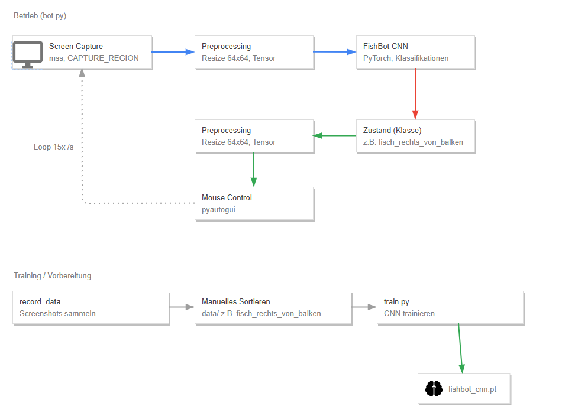

# FishBot – ML-basierte Zustandserkennung für Angel-Minigame

Erkennt per CNN die Position des Fisches relativ zum steuerbaren Balken in
einem Angel-Minigame aus Live-Screenshots und steuert die Maus entsprechend
automatisch, um den Balken auf dem Fisch zu halten

## Konzept

Statt zu versuchen, die Bewegungsrichtung des Fisch-Icons selbst zu erkennen
(nicht zuverlässig möglich, da sich das Icon nicht dreht/verändert), erkennt
das Modell die **relative Position von Fisch zu Balken in einem einzelnen
Bild** – das ist eine reine Momentaufnahme-Frage und aus einem Screenshot
klar beantwortbar.

Die Steuerungslogik (Balken zum Fisch lenken) übernimmt NICHT das Modell,
sondern einfacher, selbst geschriebener Code in `bot.py`: das Modell liefert
nur die Klassifikation, die Aktion (halten/loslassen/nichts tun) ist eine
feste Zuordnung pro Zustand, die durch die hohe Wiederholrate (mehrmals pro
Sekunde) ein kontinuierliches Nachregeln ergibt.


## Zustände & Aktionen

| Zustand | Bedeutung | Aktion |
|---|---|---|
| `fisch_rechts_von_balken` | Fisch ist rechts außerhalb des Balkens | Linksklick halten |
| `fisch_links_von_balken` | Fisch ist links außerhalb des Balkens | Linksklick loslassen |
| `fisch_auf_balken` | Fisch ist auf/im Balken | nichts tun (Position halten) |
| `balken_weg` | Balken nicht sichtbar (Angeln muss neu gestartet werden) | einmal klicken |

## Architektur

 Bild erstellt mit https://online.visual-paradigm.com/

## Setup

```bash
pip install -r requirements.txt
```

## Schritt-für-Schritt

### 1. Bildbereich festlegen
```bash
python src/pick_region.py
```
Rechteck über den Balken ziehen, Ergebnis in `src/config.py` bei
`CAPTURE_REGION` eintragen.

### 2. Trainingsdaten sammeln
```bash
python src/record_data.py
```
Lässt laufen, während du selbst spielst/angelst (mehrere Minuten, beide
Fisch-Farben, alle 4 Zustände sollten vorkommen). Bilder landen in
`data/_unsorted/`.

### 3. Bilder von Hand sortieren
Verschiebe die Bilder aus `data/_unsorted/` in:
- `data/fisch_rechts_von_balken/` – Fisch ist rechts außerhalb des Balkens
- `data/fisch_links_von_balken/` – Fisch ist links außerhalb des Balkens
- `data/fisch_auf_balken/` – Fisch ist auf/im Balken
- `data/balken_weg/` – kein Balken/Fisch sichtbar

Wichtig: Es geht NICHT mehr um die Bewegungsrichtung des Fisches, sondern
nur um die aktuelle Position von Fisch relativ zu Balken in genau diesem
einen Bild – bei jedem Bild reicht ein einzelner Blick, keine Bewegung
über mehrere Bilder hinweg nötig.

Richtwert: 150–300 Bilder pro Klasse, mit beiden Fisch-Farben (weiß/blau)
vertreten.

### 4. Modell trainieren
```bash
python src/train.py
```
Speichert das beste Modell automatisch in `models/fishbot_cnn.pt`.

### 5. Bot laufen lassen
```bash
python src/bot.py
```
Stoppen mit Strg+C oder Maus in die Bildschirmecke ziehen (Failsafe).

## Tuning

- `DEBOUNCE_FRAMES` in `config.py`: Anzahl übereinstimmender Frames, bevor
  reagiert wird. Niedriger (1) = reaktionsschneller, aber anfälliger für
  kurze Fehlklassifikationen. Höher (2-3) = stabiler, aber trägere Reaktion.
- `CAPTURE_FPS` in `config.py`: höhere Werte = feinere zeitliche Auflösung,
  aber mehr Rechenlast.

## GPU für das Training verwenden
 
- Wenn die GPU für das Training verwendet werden soll ist folgender Link die
  erste Anlaufstelle: https://pytorch.org/get-started/locally/
- Andernfalls folgender Command: pip3 install torch torchvision --index-url 
  https://download.pytorch.org/whl/cu126
- `train.py` ist so ausgelegt, dass er nach der Installation die GPU auswählt,
  anonsten bleibt er bei der CPU